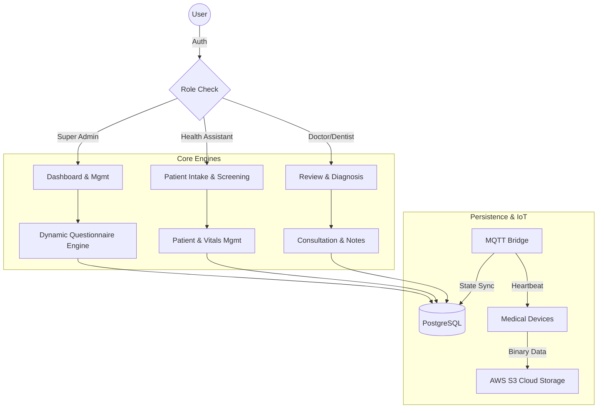
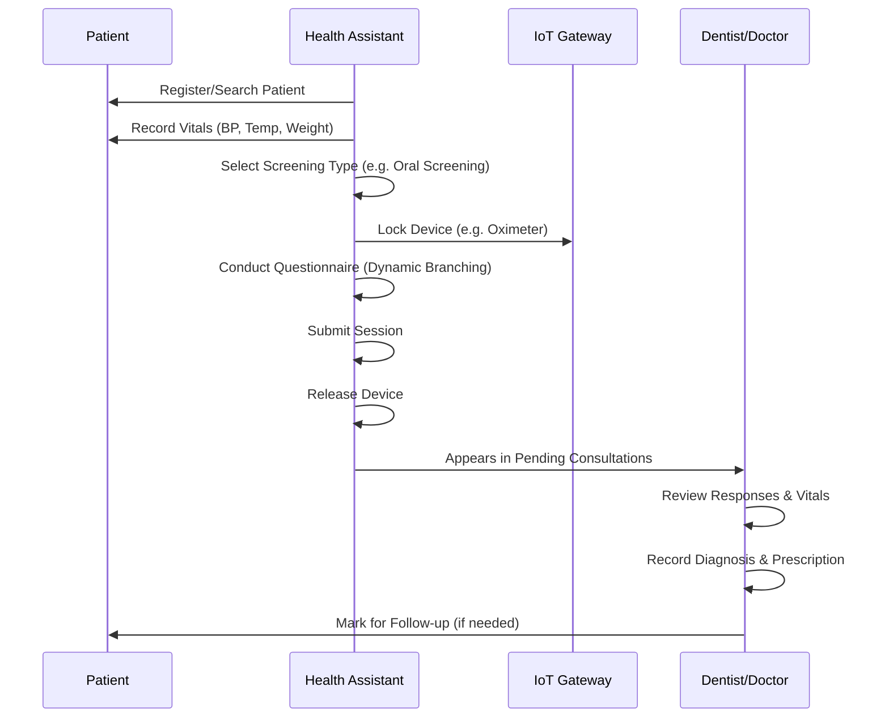

# Medical Data Collection & IoT Platform (MDCP)

A professional, enterprise-grade healthcare platform engineered for high-security medical data collection, patient lifecycle management, and real-time IoT device orchestration. Specifically tailored for clinical screenings and specialized dental workflows.

---

## 🏗️ System Architecture

MDCP is built on a modular Django framework, prioritizing **Role-Based Access Control (RBAC)**, **Data Integrity**, and **Scalability**.



---

## 👥 Roles & Responsibilities

### 1. 🛡️ Super Admin
The system architect. Responsible for the platform's clinical and technical configuration.
- **Dynamic Questionnaire Builder**: Create complex clinical surveys with recursive branching logic.
- **Device Fleet Orchestration**: Manage the inventory of medical hardware (ECGs, Oximeters, BP Monitors).
- **User Lifecycle Mgmt**: Manage credentials and roles for staff across multiple clinical sites.
- **Audit Logs**: Monitor system-wide activity for compliance and security.

### 2. 🏥 Health Assistant (The Field Operator)
The front-line user responsible for patient intake and data gathering.
- **Patient Registration**: Smart onboarding with duplicate prevention and Setu ID integration.
- **Vitals Capturing**: Direct entry of Weight, Height, BMI (auto-calculated), Blood Pressure, Heart Rate, and SpO2.
- **Screening Execution**: Initiates "Products" (Screening Types) that load standardized clinical workflows.
- **IoT Device Locking**: Reserves a physical device for a specific session to ensure zero data cross-contamination.

### 3. 👨‍⚕️ Dentist / Doctor (The Consultant)
The clinical decision-maker who reviews gathered data and provides diagnoses.
- **Pending Pool**: Real-time list of patients who have completed screenings and await consultation.
- **Clinical Deep-Dive**: Unified view of Questionnaire responses, Device data (via S3), and latest Vitals.
- **Consultation Engine**: Structured input for Provisional Diagnosis, Examination, Investigations, and Advice.
- **E-Prescription**: Dynamic medicine list builder with dosage and instruction tracking.
- **Follow-up Marking**: Categorical marking for patients requiring secondary evaluations, appearing with a `Follow-up` badge in patient lists.

---

## 🩺 Clinical Workflows

### The Complete Screening Journey


---

## 📝 Technical Implementation Details

### 1. Dynamic Questionnaire Engine
The core of the data collection is a recursive engine capable of handling:
- **Hierarchical Numbering**: Automatically computes sequence (e.g., 1.1, 1.1.1) based on trigger depth.
- **Conditional Branching**: Questions appear/disappear instantly based on "Yes/No" or "Multiple Choice" triggers.
- **Persistence**: Answers are saved as structured JSON and linked to a unique `Response` model.

### 2. IoT & Data Synchronization
- **MQTT Status Bridge**: Uses `paho-mqtt` to listen for device heartbeats (`manage.py mqtt_status_listener`).
- **Device Locking**: A mutex system in the database prevents multiple users from using the same hardware simultaneously.
- **Direct-to-Cloud Uploads**: Large clinical scans/images bypass the web server and go directly to AWS S3 using pre-signed URLs for maximum performance.

### 3. Patient Management
- **Universal ID**: Every patient gets a `MDCP-XXXX` unique identifier.
- **Setu ID Compatibility**: Full support for existing healthcare identification systems.
- **History Tracking**: All previous vital signs and consultation notes are archived chronologically.

---

## 🔗 API Reference (Core Endpoints)

### Patient Management
- **`POST /health-assistant/api/patient/register/`**: Create a new patient profile.
- **`GET /health-assistant/api/search-patients/?q=<query>`**: Search by name, ID, or phone.
- **`POST /health-assistant/api/save-vitals/`**: Submit vital signs (Weight, BP, Heart Rate, SpO2).

### IoT & Device Ops
- **`POST /iot-gateway/receive-text/`**: Ingest real-time JSON data from medical hardware.
- **`POST /iot-gateway/receive-image/`**: Upload medical scans directly to AWS S3.
- **`GET /iot-gateway/ping-device/<id>/`**: Verify physical connectivity via MQTT.

### Clinical Sessions
- **`POST /health-assistant/api/create-session/`**: Initialize a new screening lifecycle.
- **`POST /health-assistant/api/submit-questionnaire/`**: Atomic submission of survey data.

---

## 📂 Directory Structure & Responsibilities

```text
medical_platform/
├── accounts/          # Authentication & RBAC (User, Role models)
├── patients/          # Clinical Data Storage (Patient, Vitals, MedicalRecord)
├── questionnaires/    # survey Engine (Question, Branching logic, Responses)
├── screening/         # Session Management & Screening Types
├── devices/           # Device Inventory & Health tracking
├── iot_gateway/       # MQTT Integration & Data Ingestion APIs
├── health_assistant/  # Field Operator Interface & Workflows
├── doctor/            # Dentist Diagnostic Portal & Consultation Notes
├── dashboard/         # System-wide Analytics & Admin Views
├── templates/         # UI/UX Layer (Bootstrap 5 & Vanilla JS)
├── static/            # Asset Management (CSS, Images, Platform JS)
└── config/            # core Configuration (Settings, URLs, WSGI/ASGI)
```

---

## 🛠️ Installation & Regional Deployment

### Prerequisites
- **Python**: 3.9 or higher
- **Database**: PostgreSQL (preferred) or SQLite (dev)
- **Broker**: Mosquitto (for MQTT support)
- **Edge Devices**: Paho-MQTT compatible medical gateway

### Local Setup
1. **Prepare Environment**:
   ```bash
   python3 -m venv venv
   source venv/bin/activate
   pip install -r requirements-basic.txt
   ```
2. **Database Migration**:
   ```bash
   python3 manage.py migrate
   python3 manage.py createsuperuser
   ```
3. **Run Services**:
   - Web Server: `python3 manage.py runserver`
   - IoT Listener: `python3 manage.py mqtt_status_listener`

### AWS Production Deployment
The system is optimized for Ubuntu 22.04 LTS on AWS EC2.
- **Web**: Gunicorn + Nginx
- **Storage**: AWS S3 (Bucket configuration via `.env`)
- **Service Mastery**: Use `systemctl` for managing the `medical_platform` and `mqtt_bridge` services.

---

## 🔍 Recent Analyst-Driven Highlights (Phase 2 Implementations)

- **Fixed Modal Persistence**: Resolved a critical bug where registration data was lost during duplicate phone checks.
- **Dentist Personalization**: Overhauled the Doctor portal with specialized dental terminology and iconography.
- **Branching Logic Fixes**: Enhanced the Questionnaire Builder to correctly handle hierarchical numbering during "Edit" flows.
- **CSRF Hardening**: Fortified all clinical forms against cross-site request forgery.

---
© 2026 Medical Data Collection Systems | Secure | Scalable | Clinical Grade
